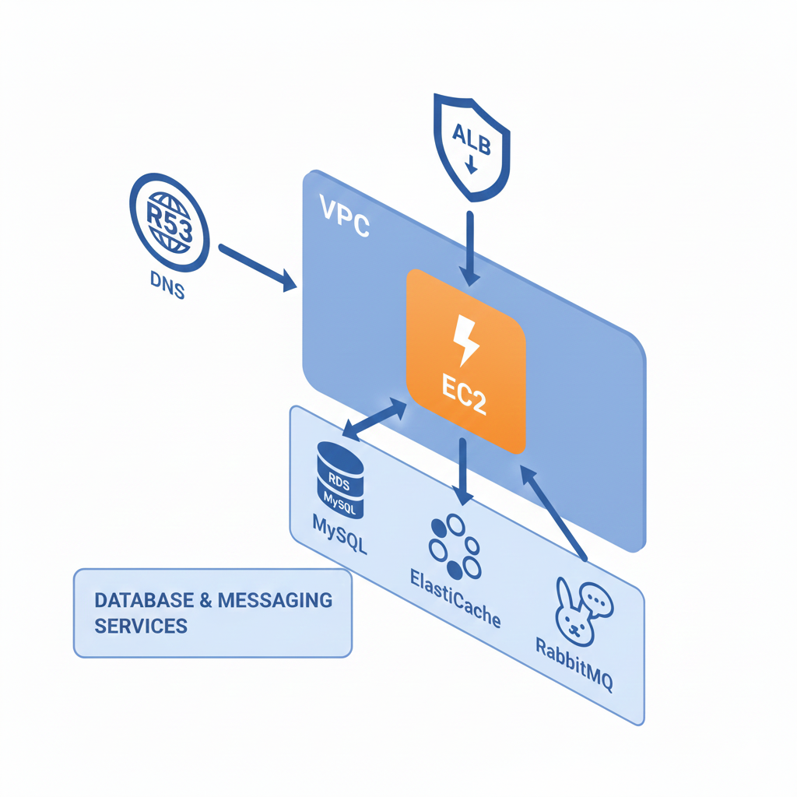
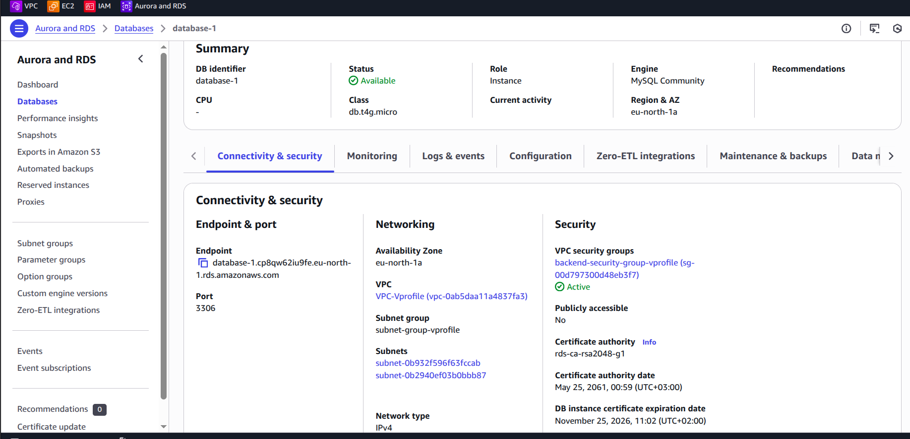
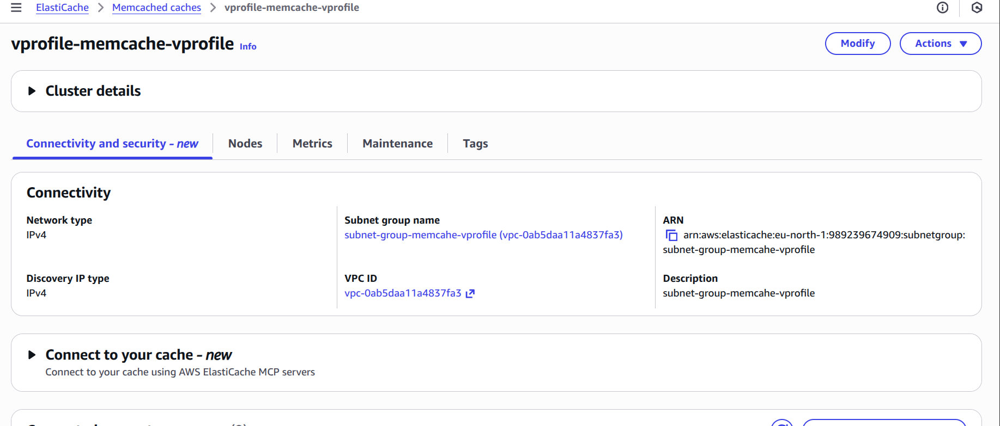
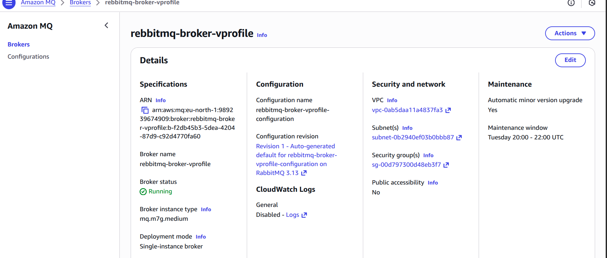
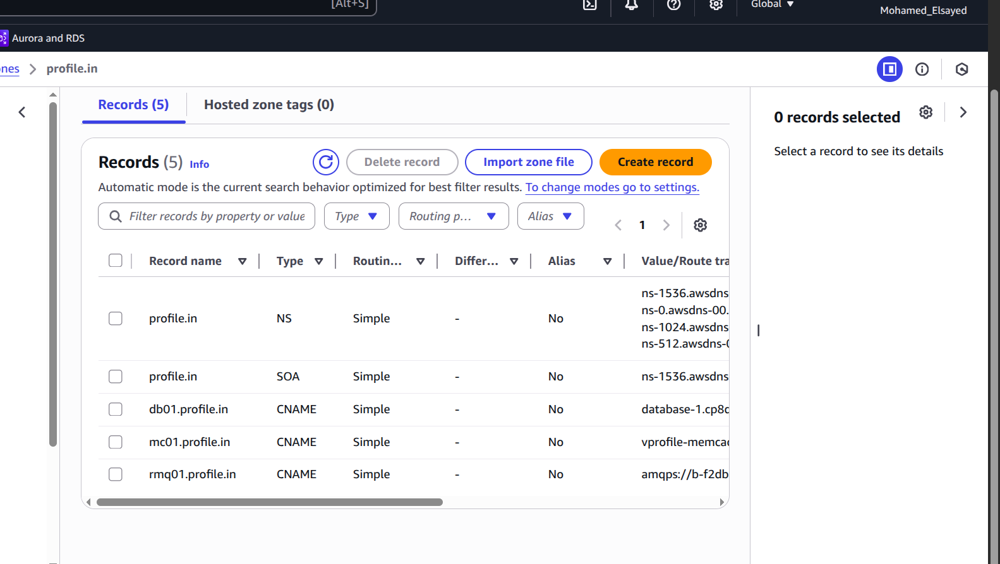
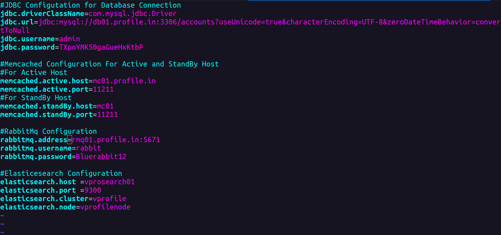

# VProfile on AWS - Cloud Native Architecture

A multi-tier Java web application re-architected for the AWS Cloud. This project demonstrates the migration of a local virtualization-based stack to a highly available, scalable, and managed cloud infrastructure using Amazon Web Services.

## Overview

VProfile is a user profile management application originally built on a local multi-VM stack (Vagrant/VirtualBox). This version has been refactored and configured to run on AWS, leveraging managed services for database, caching, and messaging to ensure high availability, fault tolerance, and scalability.

**Source Code:** [https://github.com/abdelrahmanonline4/sourcecodeseniorwr.git](https://github.com/abdelrahmanonline4/sourcecodeseniorwr.git)

## AWS Architecture

The application follows a standard 3-tier web architecture on AWS:



### Request Flow
1. **User** accesses the application via a domain name managed by **Route 53**.
2. **Application Load Balancer (ELB)** distributes traffic across healthy instances.
3. **EC2 Instances** (in Auto Scaling Group) host the Tomcat application server.
4. The application connects to backend managed services via **Route 53 Private Hosted Zone** records:
   - **RDS** for relational data (`db01.vprofile.in`)
   - **ElastiCache** for session management and caching (`mc01.vprofile.in`)
   - **Amazon MQ** for asynchronous messaging (`rmq01.vprofile.in`)

## Service Mapping

We have migrated from local services to AWS managed services:

| Service | Local Stack | AWS Cloud Service |
|---------|-------------|-------------------|
| **Application** | Tomcat on VM | **EC2 (Ubuntu)** (Tomcat 9) |
| **Database** | MySQL on VM | **Amazon RDS** (MySQL) |
| **Cache** | Memcached on VM | **Amazon ElastiCache** (Memcached) |
| **Messaging** | RabbitMQ on VM | **Amazon MQ** (RabbitMQ) |
| **Load Balancing** | Nginx/HAProxy | **Application Load Balancer** |
| **Storage** | Local Disk | **Amazon S3** (Artifacts/Logs) |

## Prerequisites

- **AWS Account** with appropriate permissions.
- **AWS CLI** configured locally.
- **Java 11 (JDK 11)** installed.
- **Maven 3.x** installed.
- **Key Pair** created in AWS for EC2 access.
- **Security Groups** configured to allow traffic between services.

## AWS Services Setup (Detailed)

This guide follows the "Custom Create" (long way) approach to give you full control over the configuration.

### 1. Network Setup (VPC)

Create a custom VPC with the following structure:
- **VPC**: Create a new VPC.
- **Subnets**:
  - **Public Subnet**: Attached to an **Internet Gateway (IGW)** for public access (Application Load Balancer, Jump Host).
  - **Private Subnets**: Two subnets in different Availability Zones (AZs) for high availability of backend services.

### 2. Security Groups

Create the following Security Groups (SG) to isolate your tiers:

1.  **ELB-SG**: Allows HTTP/HTTPS from Anywhere (`0.0.0.0/0`).
2.  **App-SG**:
    *   **Inbound Rules**:
        *   Allow traffic on port **8080** from **ELB-SG**.
        *   Allow traffic on port **80** (HTTP) from Anywhere (or restricted IP) for direct access verification.
        *   Allow SSH (22) from your IP.
3.  **Backend-SG**: This is a **Private** Security Group for your backend services.
    *   **Inbound Rules**: Allow traffic on the following ports **ONLY** from **App-SG**:
        *   Port **3306** (MySQL)
        *   Port **11211** (Memcached)
        *   Port **5672** (RabbitMQ)
    *   **Note**: This ensures that your backend services are not accessible directly from the internet or other unauthorized sources.

### 3. Database (RDS)



1.  Go to **RDS** Dashboard and click **Create database**.
2.  **Choose a database creation method**: Select **Standard create** (Custom).
3.  **Engine options**: Select **MySQL**.
4.  **Templates**: Select **Free tier**.
5.  **Settings**:
    *   **DB instance identifier**: `vprofile-db`
    *   **Master username**: `admin` (or your choice)
    *   **Master password**: `admin123` (or your choice)
6.  **DB instance class**: Select `db.t2.micro` or `db.t3.micro`.
7.  **Storage**: Disable **Storage autoscaling** to avoid unexpected costs.
8.  **Connectivity**:
    *   **Compute resource**: Don't connect to an EC2 compute resource.
    *   **VPC**: Select your custom VPC.
    *   **Public access**: **No** (Secure architecture).
    *   **VPC security group**: Select **Backend-SG**.
9.  **Additional configuration**:
    *   **Initial database name**: `accounts` (Important! This creates the schema).
10. Click **Create database**.

### 4. Cache (ElastiCache)



1.  Go to **ElastiCache** Dashboard and click **Create** -> **Memcached**.
2.  **Cluster settings**:
    *   **Name**: `vprofile-cache`
    *   **Engine version**: Default (e.g., 1.6.x)
    *   **Port**: `11211`
    *   **Node type**: `cache.t2.micro` or `cache.t3.micro` (Free Tier eligible).
    *   **Number of nodes**: `1`.
3.  **Advanced Memcached settings**:
    *   **Subnet group**: Select the Private Subnets.
4.  **Security**:
    *   **Security groups**: Select **Backend-SG**.
5.  Click **Create**.

### 5. Messaging (Amazon MQ)



1.  Go to **Amazon MQ** Dashboard and click **Create brokers**.
2.  **Broker engine type**: Select **RabbitMQ**.
3.  **Deployment mode**: Select **Single-instance broker** (Free Tier eligible).
4.  **Settings**:
    *   **Broker name**: `vprofile-mq`
    *   **Broker instance type**: `mq.t2.micro` or `mq.t3.micro`.
5.  **RabbitMQ Access**:
    *   **Username**: `guest`
    *   **Password**: `guest` (or your choice)
6.  **Additional settings**:
    *   **Security groups**: Select **Backend-SG**.
    *   **Public accessibility**: **No** (Private access only).
7.  Click **Create broker**.

---

## Route 53 Configuration



To make our application configuration clean and independent of changing AWS IP addresses/endpoints, we use a **Private Hosted Zone**.

1.  Go to **Route 53** Dashboard -> **Hosted zones**.
2.  Click **Create hosted zone**.
3.  **Domain name**: `vprofile.in` (or any internal domain you prefer).
4.  **Type**: **Private hosted zone**.
5.  **VPC**: Select the Region and VPC where your services are running.
6.  Click **Create hosted zone**.

### Create Records

Now, create **CNAME** records to map friendly names to AWS Endpoints:

| Record Name | Record Type | Value (AWS Endpoint) |
|-------------|-------------|----------------------|
| `db01.vprofile.in` | **CNAME** | `<RDS_ENDPOINT>` (e.g., `vprofile-db.xxx.us-east-1.rds.amazonaws.com`) |
| `mc01.vprofile.in` | **CNAME** | `<ELASTICACHE_ENDPOINT>` (e.g., `vprofile-cache.xxx.cache.amazonaws.com`) |
| `rmq01.vprofile.in` | **CNAME** | `<MQ_ENDPOINT>` (e.g., `b-xxx.mq.us-east-1.amazonaws.com`) |

> **Why?** This allows us to use `db01.vprofile.in` in our application code/properties. If the RDS instance changes, we only update the Route 53 record, not the code.

---

## Configuration

Update `src/main/resources/application.properties` to use the Route 53 domain names.



```properties
# JDBC Configuration (RDS)
jdbc.driverClassName=com.mysql.jdbc.Driver
jdbc.url=jdbc:mysql://db01.vprofile.in:3306/accounts?useUnicode=true&characterEncoding=UTF-8&zeroDateTimeBehavior=convertToNull
jdbc.username=admin
jdbc.password=admin123

# Memcached Configuration (ElastiCache)
memcached.active.host=mc01.vprofile.in
memcached.active.port=11211

# RabbitMQ Configuration (Amazon MQ)
rabbitmq.address=rmq01.vprofile.in
rabbitmq.port=5672
rabbitmq.username=guest
rabbitmq.password=guest
```

## Application Deployment

### 1. Launch EC2 Instance

1.  Launch an **EC2 Instance** using **Ubuntu Server 18.04/20.04 LTS**.
2.  Attach the **App-SG** security group.
3.  SSH into the instance:
    ```bash
    ssh -i key.pem ubuntu@<EC2_PUBLIC_IP>
    ```

### 2. Install Dependencies & Build Artifact

Perform all build and deployment steps directly on the EC2 instance:

```bash
# Update and install Java 11, Maven, Tomcat 9, and MySQL Client
sudo apt update
sudo apt install openjdk-11-jdk -y
sudo apt install maven -y
sudo apt install tomcat9 -y
sudo apt install mysql-client -y

# Clone the repository
git clone https://github.com/abdelrahmanonline4/sourcecodeseniorwr.git
cd sourcecodeseniorwr

# Build the artifact
mvn install
```

### 3. Initialize Database

1.  **Import the Database Dump**:
    Use the following command to connect to RDS and import the data directly from the source file:
    ```bash
    mysql -h db01.vprofile.in -u admin -p accounts < src/main/resources/db_backup.sql
    ```
    *(Enter your password when prompted)*

2.  **Verify**:
    ```bash
    mysql -h db01.vprofile.in -u admin -p accounts
    # Enter password
    show tables;
    exit;
    ```

### 4. Deploy Application

1.  **Stop Tomcat**:
    ```bash
    sudo systemctl stop tomcat9
    ```
2.  **Remove Default App**:
    ```bash
    sudo rm -rf /var/lib/tomcat9/webapps/ROOT
    ```
3.  **Deploy Artifact**:
    Copy the built WAR file to the Tomcat webapps directory as `ROOT.war`:
    ```bash
    sudo cp target/vprofile-v2.war /var/lib/tomcat9/webapps/ROOT.war
    sudo chown -R tomcat:tomcat /var/lib/tomcat9/webapps/
    ```
4.  **Start Tomcat**:
    ```bash
    sudo systemctl start tomcat9
    ```
5.  **Check Logs**:
    ```bash
    tail -f /var/log/tomcat9/catalina.out
    ```

### 5. Verify
Access the application via the EC2 Public DNS or Public IP on port 8080 (e.g., `http://<EC2_PUBLIC_IP>:8080`).
# Deploy-java-5tier-application-on-aws
